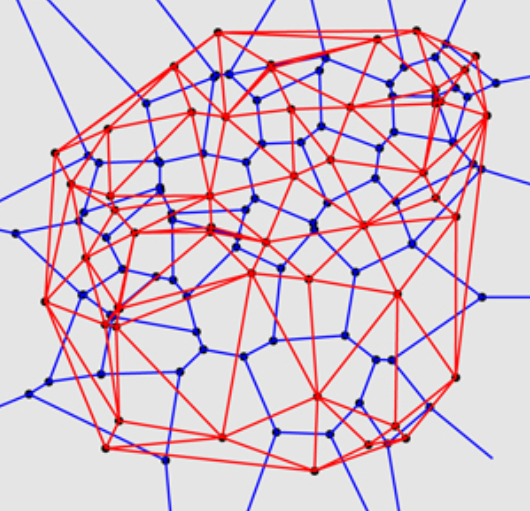
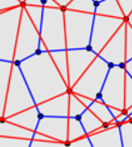
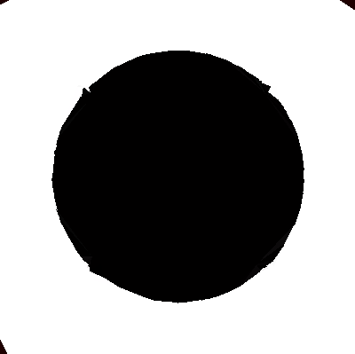
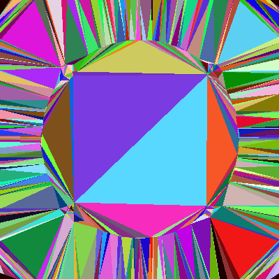
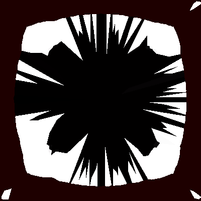
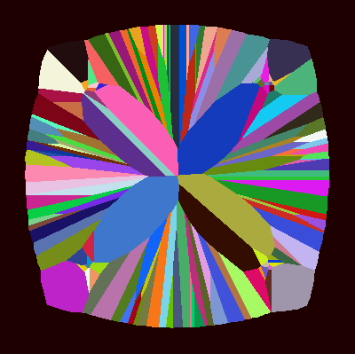
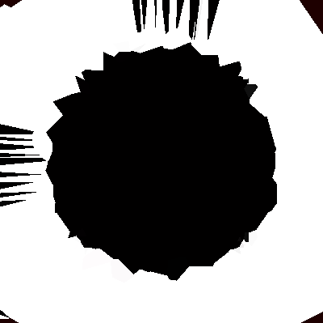
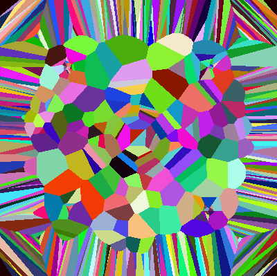

# PythonDelaunayVoronoi
Implement the Voronoi Diagram and Delaunay Triangulation from scratch for people who aren't PHD academics to be able to understand (like myself)

# Goals
* Create a workable data structure for the Delaunay Triangulation & Voronoi Diagram
* Implement the Voronoi Diagram in a way that doesn't use Fortune's Algorithm
* Provide a way for people to do these things without looking through research papers

**DV.py** - The "From Scratch" Delaunay & Voronoi classes\
**ImageManipulator.py** - Implementation of DV.py\
**ScipyDelaunay.py** - Conceptual way to do things with libraries that already exist\
**EdgeDetector.py** - Implementation of the canny edge detection algorithm

# How it works
The delaunay triangulation is easy enough to calculate with the Bowyer Watson algorithm, which I have included in **DV.py**. You can find the algorithm here: https://en.wikipedia.org/wiki/Bowyer%E2%80%93Watson_algorithm. This is certainly not the fastest way to implement this algorithm, but it gets the job done.

Creating a Voronoi data structure out of this is the tricky part.

Here, we have the triangulation in red, and the voronoi diagram in blue. Notably, each blue point is a circumcenter for a red triangle, and if we take a triangle at random and connect its circumcenter with his neighbor's circumcenter, we get the Voronoi Diagram, but still no data structure. How do we catagorize a Voronoi face?

Each Voronoi cell has one point inside of it, the node, which is a vertex from your original list of vertices. This point is shared by several different triangles in the triangulation. By collecting all of the triangles that have that node as a common vertex, we can then take the circumcenters of those triangles to get the points for our Voronoi Cell, but they are unordered. If you want to create edges correctly, you'll need to use the Graham Scan algorithm which calculates a convex hull for a set of points, which is also done in this code.

This is at least ***O(n2)*** compared to Fortune's ***O(nlogn)***. There have been attempts to create data structures for the Voronoi Diagram which can reside in more complicated space, either 3D or non-euclidian, a famous example being Guibas and Stolfi's quad-edge structure that has stronger applications in computational geometry. I dont think this code works for 3D data, though it could probably be modified to do so easily.

I originally made the mistake of assuming that the Voronoi implementation (of scipy.spatial and DV.py) would return
 the original list of input points to be used as the region vertices, like the Delaunay Triangulation. This is
  incorrect, and to do so you need to create a second Voronoi Diagram with the first diagram's region vertices as its
   input.

| | | | | |
| --- | --- | --- | --- | --- |
| Original |  |
| | d(points) | colored |
| Delaunay |  |  | | |
| | v(points) | colored | v(v(points)) | colored |
| Voronoi |  | |  |  |

See also:
http://www.geom.uiuc.edu/~samuelp/del_project.html#algorithms
http://www.cs.cmu.edu/afs/andrew/scs/cs/15-463/2001/pub/src/a2/quadedge.html

